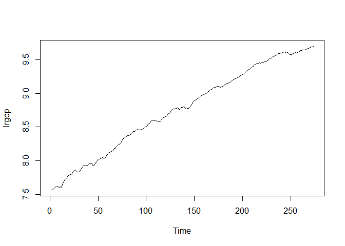
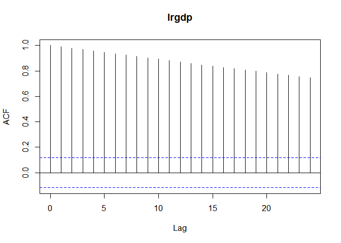
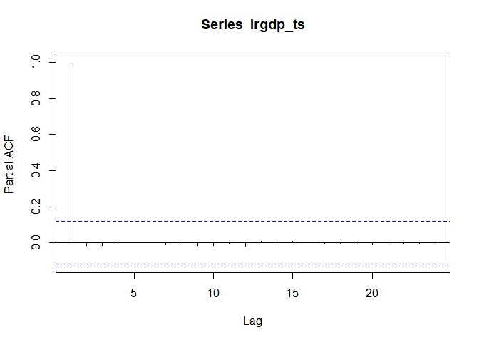
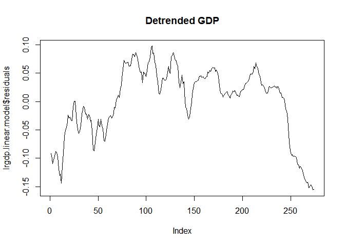
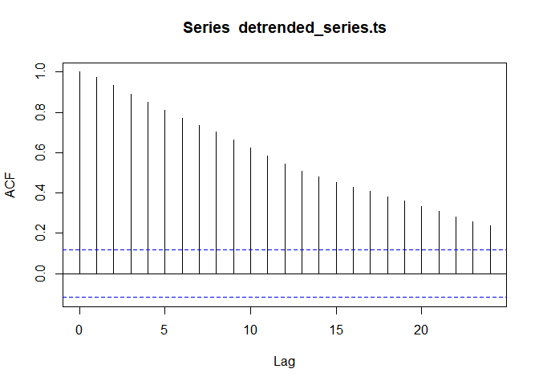
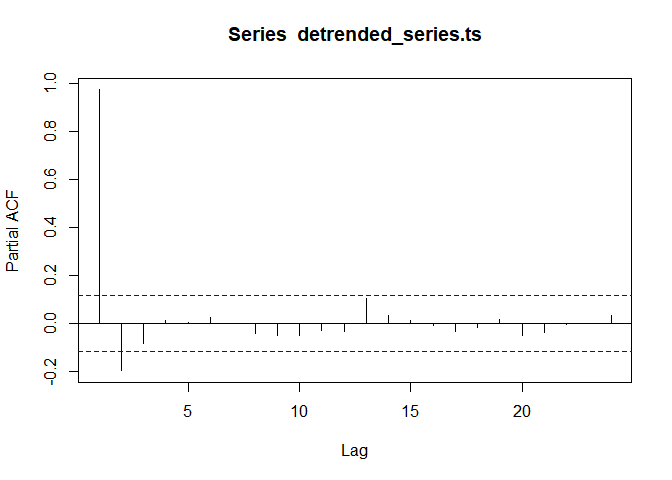
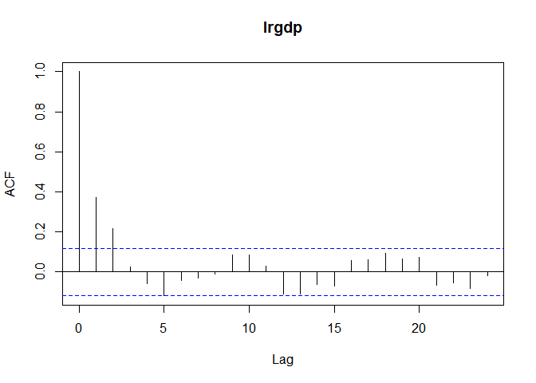
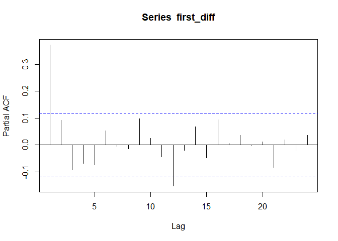

# Econ 411 HW #4
Jarred Glaser  
March 2, 2018  


# Analytical Questions

## (1)  Rewrite the following expressions without using the lag operator

###(a) 

$$ y_t = \Big(\frac{2+0.5L+0.8L^2}{L-0.6L^3}\Big)\epsilon_t$$
$$ = y_t = \frac{2\epsilon_{t}+0.5\epsilon_{t-1}+0.8\epsilon_{t-2}}{\epsilon_{t+1}-\epsilon_{t+3}}$$

### (b)

$$y_t = \Big(1+\frac{L^3}{L}\Big)\epsilon_t$$

$$ = y_t = \epsilon_t + \frac{\epsilon_{t-3}}{\epsilon_{t+1}}$$

## (2) Describe the difference between autocorrelation and partial autocorrelation. How can autocorrelation at certain displacements be positive while the partial autocorrelation at those same displacements are negative?

In autocorrelation we are looking for correlation between $y_t$ and $y_t-\tau$. In partial autocorrelation we are looking for correlation between $y_t$ and $y_{t-\tau}$ controlling for all lags in between $y_t$ and $y_{t-\tau}$. This means that the autocorrelation can be positive when the partial autocorrelation is negative at the same lags, because the partial autocorrelation is controlling for all other previous lags.

## (3) Consider an MA(2) model below.

MA(2) Model:
$$y_t = \epsilon_t+\theta_1\epsilon_{t-1}+\theta_2\epsilon_{t-2},\epsilon_t\sim WN(0,\sigma^2)$$

### (a) Show that the above model is covariance stationary (assume that it is invertible).

Covariance stationary means that the mean and the variance do not change over time.

__Mean__: 

$E(y_t)=E[\epsilon_t+\theta_1\epsilon_{t-1}+\theta_2\epsilon_{t-2}]$

$=E[\epsilon_t]+\theta_1E[\epsilon_{t-1}]+\theta_2E[\epsilon_{t-2}]$

$=E(y_t)=0$

__Variance__:

$var(y_t)=var(\epsilon_t)+\theta_1^2(\epsilon_{t-1})+\theta_2^2var(\epsilon_{t-2})$

$cov(\epsilon_t,\epsilon_{t-k}) = 0  \textrm{ for all } k \neq 0$

$var(y_t)=\sigma^2+\theta_1^2\sigma^2+\theta_2^2\sigma^2$

$=(1+\theta_1^2+\theta_2^2)\sigma^2$

### (b) Calculate conditional expectation and conditional variance of the above model. Is the conditional variance lower or higher than the unconditional variance?

__Mean__

$E[y_t|\Omega_{t-1}]=E[\epsilon_t|\Omega_{t-1}]+\theta_1 E[\epsilon|\Omega_{t-1}]+\theta_2 E[\epsilon_{t-2}|\Omega_{t-1}]$

$=\theta_1\epsilon_{t-1}+\theta_2\epsilon_{t-2}$

__Variance__

$var[y_t|\Omega_{t-1}]=E[[y_t-E[y_t|\Omega_{t-1}]]^2|\Omega_{t-1}]$

$=E[[y_t-E(y_t|\Omega_{t-1})]^2|\Omega_{t-1}]$

$=E[(y_t-(\theta_1\epsilon_{t-1}+\theta_2\epsilon_{t-2})^2|\Omega_{t-1}]$

$=E[(\epsilon_t+\theta_1\epsilon_{t-1}+\theta_2\epsilon_{t-2}-\theta_1\epsilon_{t-1}-\theta_2\epsilon_{t-2})^2|\Omega_{t-1}]$

$E[(\epsilon_t)^2|\Omega_{t-1}]=\sigma^2$


# Empirical Questions

## (1)

## (a)


```r
setwd("C:\\Users\\jarre\\OneDrive\\RStudio\\411 HW")
lrgdp <- read.csv("lrgdp.txt")
lrgdp_ts <- ts(lrgdp)
plot(lrgdp_ts)
```

<!-- -->

There is nothing extremely unusual about the data. We can see that it has an upward trend, and that consecutive values seem to follow one another fairly closely, which shows evidence that an autorregressive model could be appropriate.

## (b)


```r
library(stats)
acf(lrgdp_ts)
```

<!-- -->

```r
pacf(lrgdp_ts)
```

<!-- -->

This plot shows that there is evidence of autocorrelation at every lag. The PACF plot shows that, once all other lags are accounted for, most of the autocorrelation is coming just from the first lag, and that this would appear to be an AR(1) process.

## (c)


```r
model.ar1=arima(lrgdp_ts,order=c(1,0,0),method="ML")
model.ar1
```

```
## 
## Call:
## arima(x = lrgdp_ts, order = c(1, 0, 0), method = "ML")
## 
## Coefficients:
##          ar1  intercept
##       0.9999     8.7260
## s.e.  0.0001     1.0537
## 
## sigma^2 estimated as 0.0001521:  log likelihood = 811.14,  aic = -1616.28
```

The model shows the coefficient for AR(1) to be highly significant. The value of the coefficient is near 1. This tells us that most of the autocorrelation can be explained by the first lag.

## (d)


```r
time <- seq(length(lrgdp_ts))
lrgdp.linear.model <- lm(lrgdp$lrgdp ~ time)
plot(lrgdp.linear.model$residuals, type="l", main="Detrended GDP")
```

<!-- -->

## (e)


```r
detrended_series <- lrgdp.linear.model$residuals
detrended_series.ts <- ts(detrended_series)
acf(detrended_series.ts)
```

<!-- -->

```r
pacf(detrended_series.ts)
```

<!-- -->

Because the PACF cuts off after lag 2, and the ACF is decreasing gradually an AR(2) model may be a more appropriate fit.

## (f)


```r
first_diff <- diff(lrgdp_ts, differences = 1)
acf(first_diff)
```

<!-- -->

```r
pacf(first_diff)
```

<!-- -->

The PACF shows a sharper cutoff than the ACF. The cutoff at the PACf is at lag 1, therefore an AR(1) model would probably fit best.

## (g)


```r
### Detrended Series
combs <- expand.grid(0:3,0:3)
colnames(combs) <- c("ar","ma")
criteria <- data.frame()

for (i in 1:nrow(combs)) {
  name <- paste("Model(p,q) (",combs[i,"ar"],",",combs[i,"ma"],")",sep="")
  model <- arima(detrended_series.ts,order=c(combs[i,"ar"],0,combs[i,"ma"]),method="ML")
  criteria[i,"Model"] <- name
  criteria[i, "AIC"] <- AIC(model)
  criteria[i, "BIC"] <- BIC(model)
}

criteria[criteria$AIC == min(criteria$AIC),]
```

<div data-pagedtable="false">
  <script data-pagedtable-source type="application/json">
{"columns":[{"label":["Model"],"name":[1],"type":["chr"],"align":["left"]},{"label":["AIC"],"name":[2],"type":["dbl"],"align":["right"]},{"label":["BIC"],"name":[3],"type":["dbl"],"align":["right"]}],"data":[{"1":"Model(p,q) (1,3)","2":"-1803.583","3":"-1781.904"}],"options":{"columns":{"min":{},"max":[10]},"rows":{"min":[10],"max":[10]},"pages":{}}}
  </script>
</div>

```r
criteria[criteria$BIC == min(criteria$BIC),]
```

<div data-pagedtable="false">
  <script data-pagedtable-source type="application/json">
{"columns":[{"label":["Model"],"name":[1],"type":["chr"],"align":["left"]},{"label":["AIC"],"name":[2],"type":["dbl"],"align":["right"]},{"label":["BIC"],"name":[3],"type":["dbl"],"align":["right"]}],"data":[{"1":"Model(p,q) (2,0)","2":"-1802.335","3":"-1787.882"}],"options":{"columns":{"min":{},"max":[10]},"rows":{"min":[10],"max":[10]},"pages":{}}}
  </script>
</div>

According to the AIC, we should select an AR(1), MA(3) model for the detrended series. According on the BIC, we should select an AR(2), MA(0) model for the detrended series.


```r
### First Difference
combs <- expand.grid(0:3,0:3)
colnames(combs) <- c("ar","ma")
criteria <- data.frame()

for (i in 1:nrow(combs)) {
  name <- paste("Model(p,q) (",combs[i,"ar"],",",combs[i,"ma"],")",sep="")
  model <- arima(first_diff,order=c(combs[i,"ar"],0,combs[i,"ma"]),method="ML")
  criteria[i,"Model"] <- name
  criteria[i, "AIC"] <- AIC(model)
  criteria[i, "BIC"] <- BIC(model)
}

criteria[criteria$AIC == min(criteria$AIC),]
```

<div data-pagedtable="false">
  <script data-pagedtable-source type="application/json">
{"columns":[{"label":["Model"],"name":[1],"type":["chr"],"align":["left"]},{"label":["AIC"],"name":[2],"type":["dbl"],"align":["right"]},{"label":["BIC"],"name":[3],"type":["dbl"],"align":["right"]}],"data":[{"1":"Model(p,q) (3,2)","2":"-1804.84","3":"-1779.574"}],"options":{"columns":{"min":{},"max":[10]},"rows":{"min":[10],"max":[10]},"pages":{}}}
  </script>
</div>

```r
criteria[criteria$BIC == min(criteria$BIC),]
```

<div data-pagedtable="false">
  <script data-pagedtable-source type="application/json">
{"columns":[{"label":["Model"],"name":[1],"type":["chr"],"align":["left"]},{"label":["AIC"],"name":[2],"type":["dbl"],"align":["right"]},{"label":["BIC"],"name":[3],"type":["dbl"],"align":["right"]}],"data":[{"1":"Model(p,q) (1,0)","2":"-1799.839","3":"-1789.011"}],"options":{"columns":{"min":{},"max":[10]},"rows":{"min":[10],"max":[10]},"pages":{}}}
  </script>
</div>

According to the AIC, we should select an AR(3), MA(2) model for the first difference time series. According to the BIC, we should select an AR(1), MA(0) model for the first difference time series.


