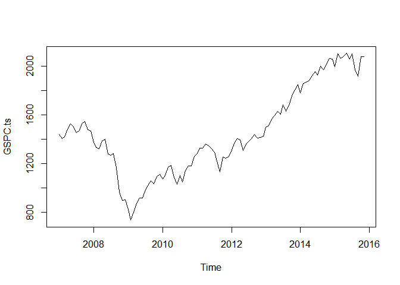
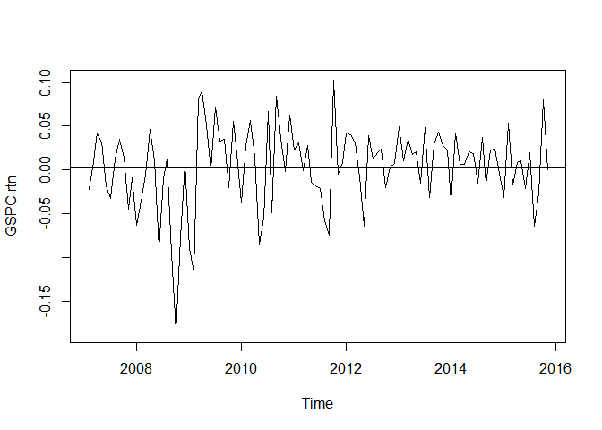
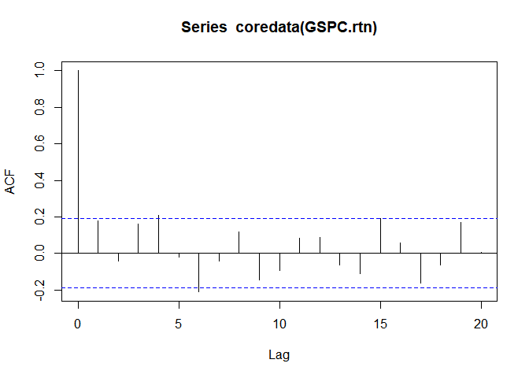
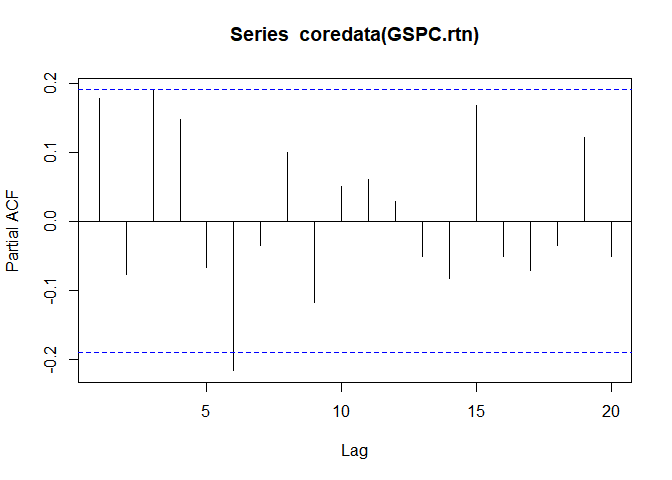
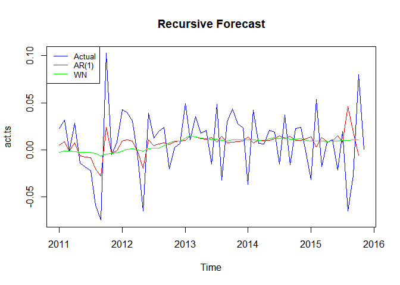
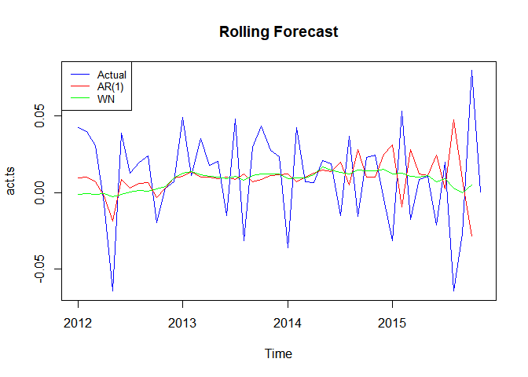

# Econ 411 HW #5
Jarred Glaser  
March 8, 2018  


__(a) Get the data for S&P500. The ticker symbol for S&P500 is GSPC. Convert the data to monthly frequency since you obtained the daily data from Yahoo Finance.__


```r
library(quantmod)
```


```r
getSymbols("^GSPC")
```

```
## [1] "GSPC"
```

```r
GSPC <- to.monthly(GSPC)
```

__(b) Convert the monthly S&P500 adjusted price level data to a time series object. Plot this monthly time series. (Note that GSPC series that youíve downloaded has six columns. From now on, use only adjusted price data)__


```r
GSPC = as.data.frame(GSPC)
GSPC_a = as.data.frame(GSPC$GSPC.Adjusted)
GSPC.ts = ts(GSPC_a,frequency=12,start=c(2007,1),end=c(2015,11))
plot(GSPC.ts,type="l")
```

<!-- -->

__(c)  Calculate the monthly return on S&P500, which is the simple difference of log of the adjusted price. Plot this rate of return and comment on the features of this data.__


```r
GSPC.rtn = diff(log(GSPC.ts))
plot(GSPC.rtn,type="l")
abline(h=mean(GSPC.rtn))
```

<!-- -->

It seems that this data follows a white noise process. It appears that the data has no real trend and the mean is close to 0.

__(d) Plot the ACF and the PACF for S&P500 stock returns. What kind of ARMA model do you think is appropriate to model S&P500 stock returns?__


```r
acf(coredata(GSPC.rtn))
```

<!-- -->


```r
pacf(coredata(GSPC.rtn))
```

<!-- -->

Judging by the ACF and PACF plots it looks like it will me either an MA(4) or MA(6), and an AR(6).

__(e) Now perform a recursive forecasting experiment for two types of model: one with AR(1) and the other with a white noise with non-zero mean. White noise with non-zero mean implies regressing stock returns on a constant only. Predictability of stock return implies that AR(1) model should dominate the white noise model. The recursive forecasting exercise should begin in 2011:01. That is, first estimate the AR(1) and the white noise model for the sample period 2007:01-2010:12 and generate forecast for 2011:01. Add one more observation to the sample and generate forecast for 2011:02 and so on, until the end of the sample. Save these forecasts and plot your forecasts with the actual stock returns for the sample period 2011:01-2015:11. Comment on your results.__


```r
ar1_pred <- vector()
wn_pred <- vector()
n.end <- 48

for (i in 1:(length(GSPC.rtn)-n.end)){
   x = GSPC.rtn[1:n.end+i-1]
   
   model_ar1 <- arima(x,order=c(1,0,0),method="ML")
   ar1_pred[i] <- predict(model_ar1,n.ahead=1,se.fit=FALSE)[1]
   
   model_wn <- lm(x~1)
   wn_pred[i] <- predict(model_wn,n.ahead=1,se.fit=FALSE)[1]
}

ar1_pred.ts <- ts(ar1_pred,frequency=12,start = c(2011,1))
wn_pred.ts <- ts(wn_pred,frequency=12,start = c(2011,1))
final <- data.frame(AR1=ar1_pred.ts,WN=wn_pred.ts)
act.ts <- ts(GSPC.rtn[48:106],frequency=12,start=c(2011,1))
  
plot(act.ts,type="l",col="blue",main="Recursive Forecast")
lines(final[,1],col="red")
lines(final[,2],col="green")
legend("topleft",legend=c("Actual","AR(1)","WN"),col=c("blue","red","green"),lty=1, cex=0.8)
```

<!-- -->

It looks like the AR(1) model is closer to the actual than the white noise model. However, there are several times where the AR(1) model is completely wrong. The white noise model is very flat, which is to be expected.

__(f) Now calculate the root mean squared errors for these two models. Which model is superior in forecasting stock returns? Is the stock market efficient? Explain.__


```r
ar_e <- GSPC.rtn[(n.end+1):106]-final[,1]
wn_e <- GSPC.rtn[(n.end+1):106]-final[,2]
rmse_ar <- sqrt(mean(ar_e^2))
rmse_wn <- sqrt(mean(wn_e^2))
rmse_ar
```

```
## [1] 0.03489065
```

```r
rmse_wn
```

```
## [1] 0.03384063
```

It seems our white noise process predicts stock returns better than the AR(1) model. The stock market, in this case, is efficient, because it is impossible for us to "beat" the market with our model, or in other words predict what the market will be and profit from that. This is to be expected, because the market follows a white noise process.

__(g) Now perform a rolling forecast of sample size 60. Follow the steps outlined in part (e). Since the estimation sample size is 60, the forecasts will be from period 2012:01 rather than from 2011:01. We increase the initial sample from 48 to 60 since we need to fix the sample in rolling forecast and higher sample size may improve the precision of the estimates. Generate forecasts of stock returns from these two models for 2012:01-2015:11 and compare their root mean squared errors. Comment on your results.__


```r
ar1_pred <- vector()
wn_pred <- vector()
n.end <- 60

for (i in 1:(length(GSPC.rtn)-n.end)){
   x = GSPC.rtn[i:n.end+i-1]
   
   model_ar1 <- arima(x,order=c(1,0,0),method="ML")
   ar1_pred[i] <- predict(model_ar1,n.ahead=1,se.fit=FALSE)[1]
   
   model_wn <- lm(x~1)
   wn_pred[i] <- predict(model_wn,n.ahead=1,se.fit=FALSE)[1]
}

ar1_pred.ts <- ts(ar1_pred,frequency=12,start = c(2012,1))
wn_pred.ts <- ts(wn_pred,frequency=12,start = c(2012,1))
final <- data.frame(AR1=ar1_pred.ts,WN=wn_pred.ts)
act.ts <- ts(GSPC.rtn[60:106],frequency=12,start=c(2012,1))
  
plot(act.ts,type="l",col="blue",main="Rolling Forecast")
lines(final[,1],col="red")
lines(final[,2],col="green")
legend("topleft",legend=c("Actual","AR(1)","WN"),col=c("blue","red","green"),lty=1, cex=0.8)
```

<!-- -->


```r
ar_e <- GSPC.rtn[(n.end+1):106]-final[,1]
wn_e <- GSPC.rtn[(n.end+1):106]-final[,2]
rmse_ar <- sqrt(mean(ar_e^2))
rmse_wn <- sqrt(mean(wn_e^2))
rmse_ar
```

```
## [1] 0.03113367
```

```r
rmse_wn
```

```
## [1] 0.03064625
```

The RMSE's went down for both AR(1) and WN, but the WN is still better at forecasting than the AR(1).

__(h) Now estimate the two models for the sample period 2007:01-2014:12 and perform 11-step ahead forecast. Plot your forecasts with the actual stock return data. Comment on your results.__


```r
sample_period <- length(ts(start=c(2007,1),end=c(2014,12),freq=12))
m1 <- arima(GSPC.rtn[1:sample_period],c(1,0,0),method="ML")
p1 <- predict(m1, n.ahead=11,se.fit=FALSE)[11]

m2 <- lm(GSPC.rtn[1:sample_period]~1)
p2 <- predict(m2, n.ahead=11,se.fit=FALSE)[11]

#Actual Return
GSPC.rtn[106]
```

```
## [1] 0.0005047419
```

```r
#AR(1) Predicted
p1
```

```
## [1] 0.003238724
```

```r
#White Noise Predicted
as.numeric(p2)
```

```
## [1] 0.00340853
```

```r
#Absolute Error for AR(1)
abs(p1-GSPC.rtn[106])
```

```
## [1] 0.002733982
```

```r
#Absolute Error for AR(2)
abs(as.numeric(p2)-GSPC.rtn[106])
```

```
## [1] 0.002903788
```

The AR(1) process is a little closer in absolute value to the actual value than the white noise process for this 11 step ahead prediction. However, both models are very far from the actual return value, which shows that as we increase our step ahead forecase, our predictions generally get weaker.


